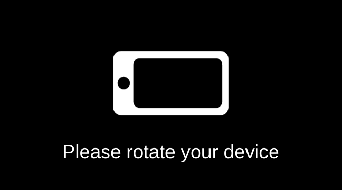

[](https://badge.fury.io/js/device-rotation-prompt)
[](https://circleci.com/gh/Raiper34/device-rotation-prompt)


[](https://device-rotation-prompt.netlify.app)

# Device rotation prompt

The device rotation prompt is the library to show a fullscreen prompt message when device orientation is different than you expect.
It is designed to be used in html5 games, but it can be used on any website.

# Instalation
Install library using npm `npm install device-rotation-prompt --save` and import main class into your code base `import {DeviceRotationPrompt} from 'device-orientation-prompt';`.


# Usage
If you do not need to configure and the default style and setting are enough, you can just instantiate the class and you are done.
```javascript
const prompt = new DeviceRotationPrompt();
```
and you get



If you do not need this functionality anymore, you can destroy it using `destroy` method.
```javascript
prompt.destroy();
```

If you want to configure the behavior and style of the prompt, you can pass the config object during instantiation.
```javascript
const prompt = new DeviceRotationPrompt({
    orientation: 'landscape',
    backgroundColor: '#000000',
    imageColor: '#ffffff',
    ...
});
```
The properties are as follows and all are optional.

| **Property** | Default                                                 | Description                                                                                                      |
|--------------|---------------------------------------------------------|------------------------------------------------------------------------------------------------------------------|
| **orientation**  | `'landscape'`                                           | The orientation you want to force, if orientation is different, prompt is showed (`'landscape'` or `'portrait'`) |
| **backgroundColor**  | `'#000000'`                                             | Background color of whole prompt                                                                                 |
| **imageColor**  | `'#ffffff'`                                             | Color of device image                                                                                            |
| **imageSize**  | `'60vh'` for portrait `'30vh'` for landscape                | Size of device image (all css units like `'px'`, `'em'`, `'rem'`, `'vh'`...)                                     |
| **hideImage**  | `false`                                                 | Hide/show image                                                                                                  |
| **animationDisable**  | `false`                                                 | Enable/disable image animation                                                                                   |
| **text**  | `'Please rotate your device'`                           | Description text to show                                                                                         |
| **textColor**  | `'#ffffff'`                                             | Color of description text                                                                                        |
| **textSize**  | `'10vh'` for portrait `'5vh'` for landscape                 | Size of description text (all css units like `'px'`, `'em'`, `'rem'`, `'vh'`...)                                                                                         |
| **textFont**  | `'\'Arial Black\', \'Arial Bold\', Gadget, sans-serif'` | Font of description text                                                                                         |
| **hideText**  | `false`                                                 | Hide/show description text                                                                                       |
| **containerId**  | `'promptContainer'`                                     | Id of whole container prompt                                                                                     |
| **imageId**  | `'promptImage'`                                         | Id of svg image                                                                                                  |
| **textId**  | `'promptText'`                                          | Id of container with description text                                                                            |
| **styleId**  | `'promptStyle'`                                         | Id of style tag, where all styles of this library are defined                                                    |
| **zIndex**  | `undefined`                                             | z-index of whole prompt (`number`)                                                                               |


# Usage in browser
TODO

# License
MIT